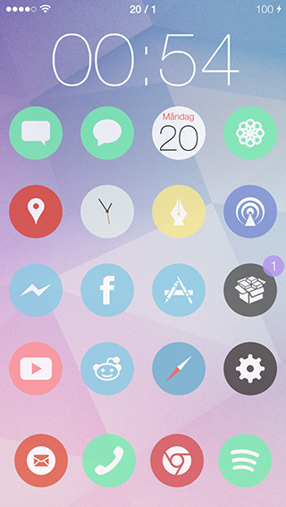
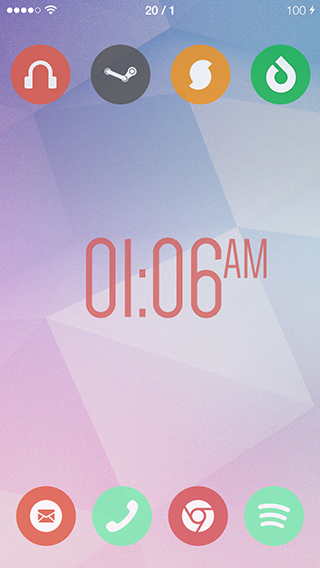
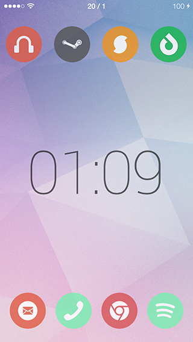
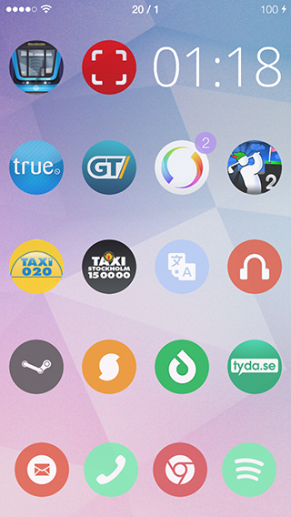

# NiceTime iWidget Clock

A **nice**, customizable clock widget for use with [iWidgets](http://modmyi.com/forums/iphone-4-4s-new-skins-themes-launches/805840-tweak-iwidgets.html) (on jailbroken iOS devices).

Features the following customization options:

* 24 hour clock
* Color
* Opacity
* Font (40+ to choose from)
* Font size

Available on the [ModMyi ](http://modmyi.com/info/nicetimeiwidgetclock.d.php) Cydia repository.

## Grunt setup:
* Install [Node.js](http://nodejs.org/) and [npm](https://npmjs.org/).
* `cd` to the root folder of the repo and run `npm install` to install dependencies (_including Grunt if you don't already have it_).
* Run `grunt` for initial compilation.
* Run `grunt watch` for on-the-fly compilation.
* To build the project for distribution, run `grunt build`. 
* The build process can automatically create a `.deb` file. This requires `dpkg` to be installed (I recommend doing so via [Homebrew](http://brew.sh/) if you're on OS X).

## Installation:

### Option 1 – File transfer:
**Note:** Requires iWidgets to be installed prior to executing the following steps.

* Transfer the `dist/NiceTime-iWidget-Clock/var/mobile/Library/iWidgets/NiceTime iWidget Clock` folder to your device and place it in, you guessed it: `/var/mobile/Library/iWidgets/`.
* The widget is now available from iWidgets. 

### Option 2 – Building the .deb package:

#### On Linux / Mac OS X (if for some reason you can't do it with the Grunt build step):
* Install **dpkg** (I recommend doing so via [Homebrew](http://brew.sh/) if you're on OS X).
* Fire up a terminal and `cd` to the `dist` folder (after having done `grunt build`).
* Run `dpkg-deb -Zgzip -b NiceTime-iWidget-Clock`.

#### On a jailbroken iOS device:
* Install **MobileTerminal** from the BigBoss repo in Cydia.
* Transfer the `dist/NiceTime-iWidget-Clock` folder to your device.
* In MobileTerminal; `cd` to the parent folder of `NiceTime-iWidget-Clock`.
* Run `dpkg-deb -b NiceTime-iWidget-Clock`.

##### Install the package:
* **Option 1 – iFile:** Open the `.deb` in [iFile](http://cydia.saurik.com/package/eu.heinelt.ifile) and choose `Installer`.
* **Option 2 – Cydia Auto Install:** 
    * Navigate to `/private/var/root/Media` on your device. 
    * If this folder doesn't already contain a sub-folder named `Cydia`, create it. 
    * Inside the `Cydia` folder, create a sub-folder named `AutoInstall`. 
    * Place the `.deb` file in the `AutoInstall` folder.
    * Once copying is complete, restart your device — twice. After the 2nd restart, the package should show up in Cydia and in iWidgets.
* **Option 3 – MobileTerminal:** 
    * In **MobileTerminal**, `cd` to the folder where you put the `.deb` file.
    * Run `dpkg -i NiceTime-iWidget-Clock.deb`.

## Screenshots:

## Changelog:

* **1.0.1** – Add "AM/PM" toggle if not using 24 Hour Clock
* **1.0.0** – Initial release
