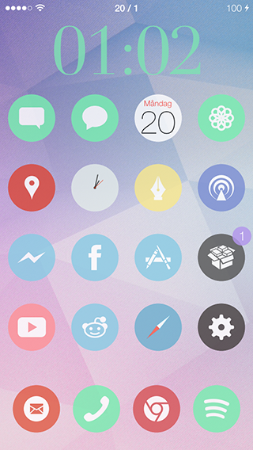

# NiceTime iWidget Clock

A **nice**, customizable clock widget for use with [iWidgets](http://modmyi.com/forums/iphone-4-4s-new-skins-themes-launches/805840-tweak-iwidgets.html) (on jailbroken iOS devices).

Features the following customization options:

* 24 hour clock
* Color
* Opacity
* Font (40+ to choose from)
* Font size

Available on the [ModMyi ](http://modmyi.com/info/nicetimeiwidgetclock.d.php) Cydia repository.

## Installation
***Note:** Requires iWidgets to be installed prior to executing the following steps.*

### Simple file transfer
* Transfer the `dist/nicetime-iwidget-clock/var/mobile/Library/iWidgets/NiceTime iWidget Clock` folder to your device and place it in, you guessed it: `/var/mobile/Library/iWidgets/`.
* The widget is now available from iWidgets. 

### Building the .deb package

#### On Mac OS X
* Install **dpkg** (I recommend doing so via [Homebrew](http://brew.sh/)).
* Fire up a terminal and `cd` to the `dist` folder.
* Run `dpkg-deb -b nicetime-iwidget-clock`.

#### On a jailbroken iOS device
* Install **MobileTerminal** from the BigBoss repo in Cydia.
* Transfer the `dist/nicetime-iwidget-clock` folder to your device.
* In MobileTerminal; `cd` to the parent folder of `nicetime-iwidget-clock`.
* Run `dpkg-deb -b nicetime-iwidget-clock`.

You can now install the .deb-file via [iFile](http://cydia.saurik.com/package/eu.heinelt.ifile).

## Screenshots

